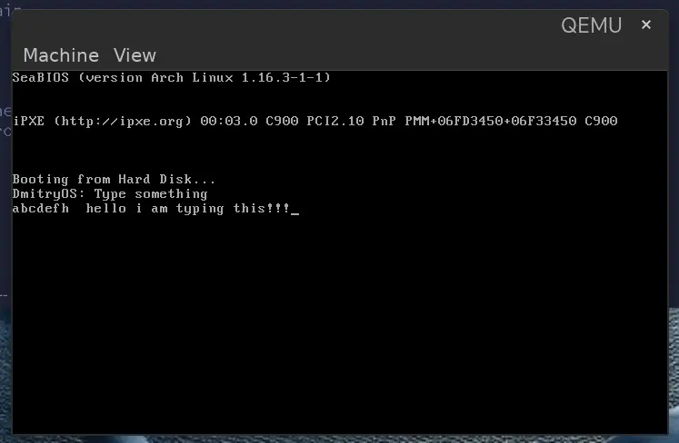

# Bare Metal OS in Rust

This is an experimental bare metal operating system written in Rust and Assembly, inspired by [Philipp Oppermann's Blog OS](https://github.com/phil-opp/blog_os). Code and implementation developed with assistance from Claude 3.5 Sonnet.

## Project Overview

This project is a hands-on exploration of operating system development using:
- Rust for the kernel
- Assembly for boot code
- Custom bootloader implementation

## Project Structure

- `boot.asm` / `boot2.asm` - Assembly boot code
- `src/main.rs` - Kernel entry point
- `src/vga_buffer.rs` - VGA text mode buffer implementation
- `Cargo.toml` - Rust project configuration
- `x86_64-blog_os.json` - Custom target specification

## Building

Make sure you have the following prerequisites:
- Rust nightly
- `cargo-bootimage` tool
- QEMU for testing (optional)

Build the project:
```bash
cargo build
```

Create bootable image:
```bash
cargo bootimage
```

## Running

### Running Rust OS
You can run the OS in QEMU:
```bash
qemu-system-x86_64 -drive format=raw,file=target/x86_64-blog_os/debug/bootimage-blog_os.bin
```

Or using cargo run (if configured):
```bash
cargo run
```


### Running Assembly Boot Code
To run the assembly boot code variants:

```bash
# Run first boot code variant
make run1
```


```bash
# Run second boot code variant
make run2
```


The assembly variants demonstrate:
- `run1`: A simple 16-bit real mode bootloader that displays a message and echoes keyboard input
- `run2`: A graphics demo that switches to VGA mode (320x200, 256 colors) and draws a circle using the midpoint circle algorithm

## Learning Resources

- [Writing an OS in Rust](https://os.phil-opp.com/) by Philipp Oppermann
- [OSDev Wiki](https://wiki.osdev.org/)

## Status

This is an educational project aimed at learning OS development concepts through hands-on implementation. Currently implements:
- Basic boot sequence
- VGA text mode output
- More features to come...

## License

[MIT License](LICENSE) (or specify your chosen license)